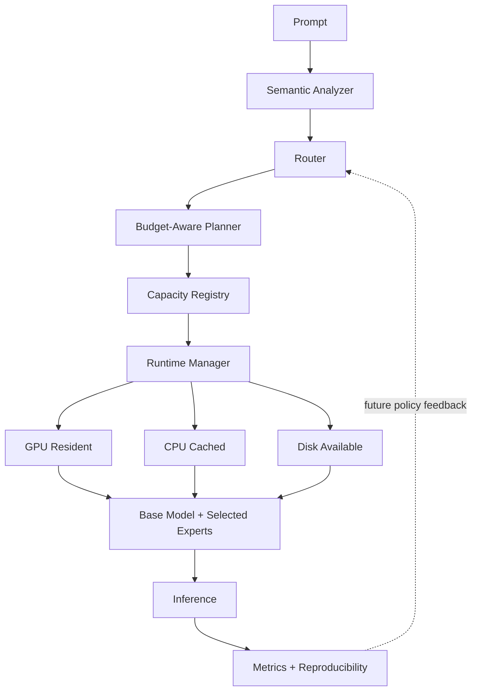

# SelectiveLLM

**Semantic Model Paging and Dynamic Expert Routing for Memory-Constrained LLM Inference**

[](https://github.com/selectivellm/selectivellm/actions/workflows/ci.yml)
[](https://www.python.org/)
[](LICENSE)
[](docs/paper.md)

**Can larger language-model capabilities be exposed under smaller memory budgets by loading only the capacity relevant to the current request?**

SelectiveLLM is an experimental inference framework exploring **retrieval over model capacity**: multi-label semantic routing, dynamic expert and PEFT/LoRA loading, budget-aware planning, memory-aware caching, and eventually parameter-level paging. This is not traditional RAG; the selected resource is model capacity rather than external documents.

> [!IMPORTANT]
> SelectiveLLM does NOT currently turn a dense 70B model into a 7B-memory model.
>
> The included v0.1 evidence comes from a deterministic-control backend. Its expert capacities are simulated registry declarations, its task score is synthetic capability coverage, and it does **not** demonstrate physical VRAM savings or language-model quality. The real Transformers/PEFT backend uses the same methodology but requires compatible user-supplied model and adapter assets.

## The experiment

Traditional fixed-residency inference keeps all configured capacity available. SelectiveLLM analyzes each prompt, requests one or more capabilities, and lets a runtime planner fit those components under a declared budget.



```text
Prompt -> Analyzer -> Router -> Budget Planner -> Registry
                                             |
                         +-------------------+------------------+
                         |                   |                  |
                    GPU resident        CPU cached        Disk available
                         +-------------------+------------------+
                                             |
                              Base model + selected experts
                                             |
                                    Inference -> Metrics
```

The hero experiment compares base-only, random, keyword, oracle, embedding, semantic, cached, and all-resident controls on single-domain, ambiguous, irrelevant-domain, and multi-domain prompts. Every row carries its backend, model identity, versioned inputs, measurement semantics, and compatibility fingerprint.


### Included control result

Backend: **`deterministic-control`** | Benchmark: **`hero-1.0.0`** | 16 cases x 5 repetitions | Accelerator memory: **unavailable**

| Method | Control score | Oracle retention | Routing F1 | Declared peak capacity | Reduction vs all-resident | Expert cache hit rate |
|---|---:|---:|---:|---:|---:|---:|
| Base only | 0.431 | 43.1% | 0.125 | 500.0 MB | 68.4% | 0.0% |
| Random | 0.514 | 51.4% | 0.150 | 860.0 MB | 45.6% | 0.0% |
| Keyword | 0.503 | 50.3% | 0.198 | 680.0 MB | 57.0% | 0.0% |
| Oracle | 1.000 | 100.0% | 1.000 | 1019.8 MB | 35.5% | 0.0% |
| Semantic | 0.797 | 79.7% | 0.633 | 857.8 MB | 45.7% | 0.0% |
| Semantic + cache | 0.797 | 79.7% | 0.633 | 857.8 MB | 45.7% | 31.2% |
| All resident | 0.963 | 96.3% | 0.368 | 1580.0 MB | 0.0% | 98.8% |

These numbers demonstrate that the implemented router, planner, cache, metrics, and reporting pipeline respond quantitatively to independently defined capacity and workload locality. They do not establish equivalent behavior for real adapters. See the [complete report](results/latest/report.md), [raw observations](results/latest/raw_results.jsonl), [failure analysis](results/latest/routing_failures.md), and [manifest](results/latest/manifest.json).

## What currently works

- Multi-label prompt profiles retaining Python, mathematics, electrical engineering, reasoning, software engineering, scientific writing, and general signals.
- Static, keyword, random, oracle, embedding, top-k, threshold, and hybrid routers with scores, confidence, latency, and debug metadata.
- Versioned YAML capacity registry with dependencies, declared memory, backend identity, paths, tasks, embeddings, priorities, and parameter counts.
- Budget-aware planning that records rejected relevant capacity instead of silently dropping it.
- Dependency-aware LRU lifecycle management with expert-only hit rates, misses, evictions, swaps, and load/unload latency.
- Strict separation of simulated declared capacity, observed host RSS, and available accelerator allocation/reservation/peak metrics.
- One backend contract for deterministic control and real Hugging Face Transformers + PEFT/LoRA operation.
- CUDA -> MPS -> CPU detection, with no CUDA assumption in the default path.
- Reproducible benchmark directories containing versioned configuration, environment, raw JSONL, summaries, CSV, report, routing decisions, failures, and five plots.
- Compatibility guards using hashes of benchmark content, registry content, routing configuration, model/adapter identity, seed policy, device class, and measurement semantics.

## What this is not

- It is not document retrieval or a RAG implementation.
- It is not a newly trained Mixture-of-Experts architecture.
- v0.1 is adapter/expert routing as a testable proxy for a broader capacity-routing hypothesis.
- It does not show that dense-model knowledge can be separated into clean semantic parameter blocks.
- It does not bundle model weights or make claims across incompatible backends.

## Quickstart

Python 3.11 or newer is required.

```bash
git clone https://github.com/selectivellm/selectivellm.git
cd selectivellm
python3.11 -m venv .venv
source .venv/bin/activate
pip install -e .
selectivellm demo
```

The demo runs offline in under five minutes, detects hardware, routes four prompts including a three-capability RLC request, displays selected and rejected capacity, shows cache events, and labels all control measurements.

Run the full reproducible experiment:

```bash
selectivellm benchmark --report --repetitions 5 --seed 42
open results/latest/report.md  # macOS; open the file normally elsewhere
```

## CLI

```bash
# Route and generate with the default control backend
selectivellm run --prompt "Explain a MOSFET gate driver" --verbose

# Compare one method or the full method matrix
selectivellm benchmark --router semantic --report
selectivellm benchmark --report --repetitions 5

# Inspect stage timing and memory semantics
selectivellm profile --prompt "Write a Python FastAPI endpoint"
selectivellm inspect

# Inspect available capacity
selectivellm registry list
selectivellm registry inspect python_expert

# Explicit execution modes
selectivellm run --mode full_model --prompt "Summarize sparse inference"
selectivellm run --mode offload --config configs/transformers_peft.example.yaml --prompt "Explain an RLC circuit"
```

## Python API

```python
from selectivellm import SelectiveLLM

engine = SelectiveLLM.from_config("configs/default.yaml")
result = engine.generate("Use Python to simulate an RLC circuit and plot the transient response")

print(result.text)
print(result.profile.capabilities)
print(result.routing.selected)
print(result.plan.rejected)
print(result.memory)
print(result.metrics)
```

## Real Transformers and PEFT

Install the optional backend and edit the example registry with compatible local or explicitly trusted Hub paths:

```bash
pip install -e ".[hf]"
selectivellm run \
  --config configs/transformers_peft.example.yaml \
  --prompt "Explain a MOSFET gate driver"
```

The real backend loads a causal language model, adds named PEFT adapters, activates selected adapters, deletes evicted adapters where supported, synchronizes accelerator timing, and reports actual memory telemetry where PyTorch exposes it. `trust_remote_code` defaults to `false`. Multi-adapter composition can fail when adapters are incompatible; this is reported explicitly.

Model and adapter licenses are separate from the Apache-2.0 project license. SelectiveLLM does not redistribute weights.

## Experimental modes

| Mode | Purpose | v0.1 status |
|---|---|---|
| Full model | Dense/base generation baseline | Implemented through the common backend |
| CPU/GPU offload | Conventional placement baseline | Configured through Transformers + Accelerate `device_map`; real evidence pending |
| Semantic expert routing | Shared base plus selected adapters/experts | Implemented; control evidence included |
| Multi-model expert pool | Systems-level proxy, not parameter paging | Interface-compatible future experiment |

## Benchmark contract

The latency decomposition is:

```text
T_total = T_route + T_plan + T_load + T_inference + T_orchestration
```

Aggregates report count, mean, median, sample standard deviation, p50, p95, and a normal-approximation 95% confidence interval where meaningful. Missing hardware measurements remain `null`. A single-method run reports relative quality/memory metrics as `N/A` because it lacks oracle and all-resident denominators.

```text
results/<run-id>/
  config.yaml
  environment.json
  manifest.json
  raw_results.jsonl
  routing_decisions.jsonl
  summary.json
  summary.csv
  report.md
  routing_failures.md
  plots/
```

Read the full [benchmark methodology](docs/benchmarking.md) before comparing runs. Null and negative results are retained by policy.

## Research questions

**RQ1:** Can semantic routing accurately predict which specialized model capacity a prompt requires?

**RQ2:** How much memory can dynamic expert loading save compared with keeping all experts resident?

**RQ3:** What latency penalty is introduced by swapping capacity?

**RQ4:** Can caching recover most of that latency on realistic mixed-domain workloads?

**RQ5 (future research):** Does task specialization eventually permit useful parameter-level paging inside dense transformers?

## Limitations and falsification

The current analyzer is a transparent deterministic feature-hash control, not a learned semantic encoder. The workload is small and authored. Control quality is mechanically tied to required-capability coverage. The included run therefore validates the framework and experimental plumbing, not the central real-model hypothesis.

A strong falsification test uses a pre-registered held-out workload, a real shared base and validated adapters, repeated workload orders, and equal decoding settings. The hypothesis is weakened or falsified for that setup if semantic routing does not beat keyword/random routing, does not retain quality relative to oracle/all-resident, or incurs enough transfer latency that no useful quality-memory-latency point remains.

Parameter-level semantic paging becomes credible only after causal importance masks are stable across held-out tasks and paraphrases, beat random/pruning baselines, compose across domains, map to hardware-efficient blocks, and produce measured physical memory or compute savings after routing and transfer overhead.

## Documentation

- [Concepts and scientific claims](docs/concepts.md)
- [Architecture and extension contracts](docs/architecture.md)
- [Benchmarking and validity](docs/benchmarking.md)
- [Related work and novelty positioning](docs/related_work.md)
- [Research questions and hypothesis matrix](docs/research_questions.md)
- [Semantic parameter paging research agenda](docs/research/semantic_parameter_paging.md)
- [Living technical report](docs/paper.md)
- [Roadmap](docs/roadmap.md)
- [v0.1.0 release notes](docs/releases/v0.1.0.md)

## Development

```bash
pip install -e ".[dev]"
ruff format --check .
ruff check .
mypy selectivellm
pytest --cov=selectivellm --cov-report=term-missing
python -m build
```

Tests are network-free and do not download models. Optional real-backend integration requires user-supplied compatible assets.

## Roadmap

The next evidence milestone is a license-compatible real base/adapters experiment with held-out quality evaluation and observed accelerator memory. Later milestones cover cache-policy comparisons, learned routing, adapter composition/interference, activation tracing, causal importance masks, and only then hardware-aligned parameter paging. See the [evidence-gated roadmap](docs/roadmap.md).

## Citation

Use [CITATION.cff](CITATION.cff) and include the exact benchmark fingerprint when citing a result. The v0.1 software is Apache-2.0 licensed; external model and adapter licenses still apply.

## Contributing

Reproducible positive, null, and negative results are welcome. Read [CONTRIBUTING.md](CONTRIBUTING.md), [SECURITY.md](SECURITY.md), and the [Code of Conduct](CODE_OF_CONDUCT.md) before opening a contribution.
