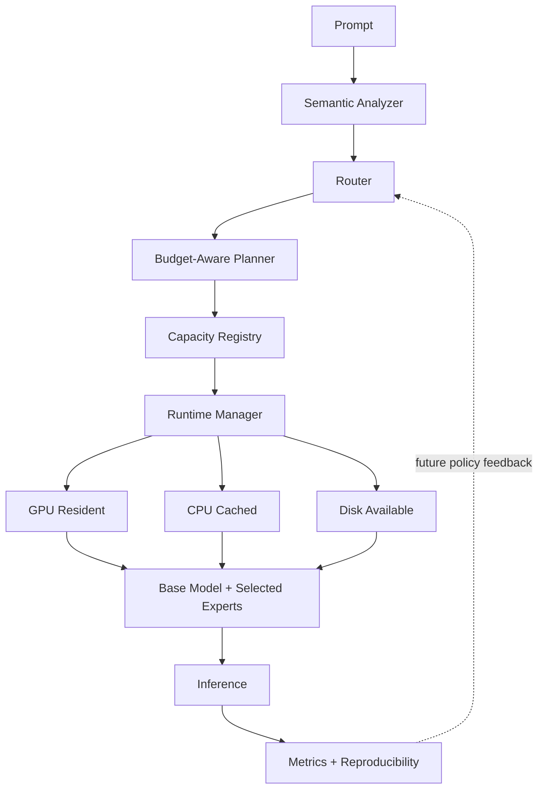
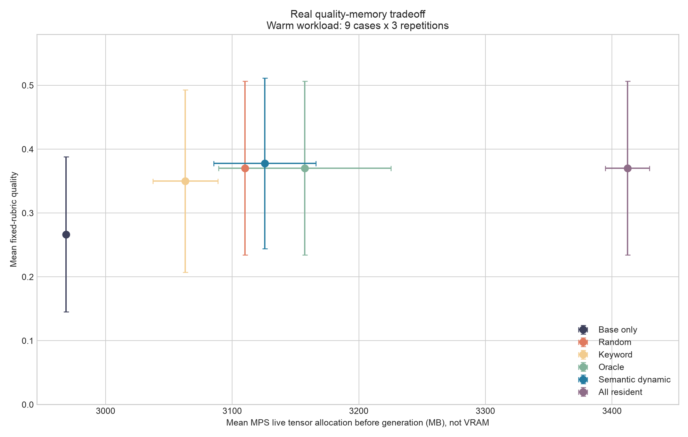
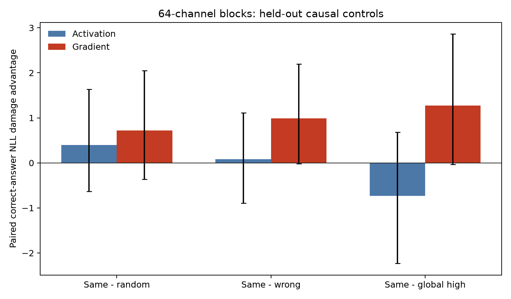
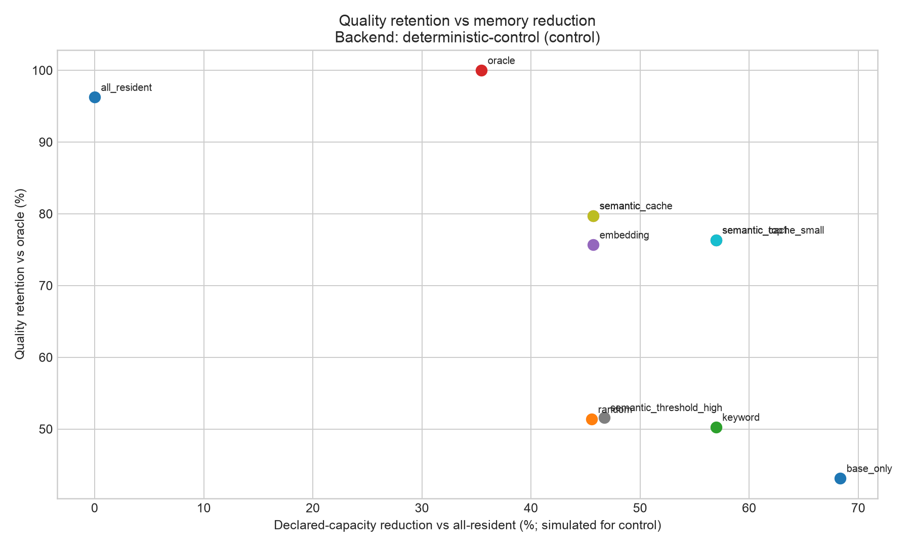

# SelectiveLLM

**Semantic Model Paging and Dynamic Expert Routing for Memory-Constrained LLM Inference**

[](https://www.python.org/)
[](LICENSE)
[](docs/paper.md)

**Can larger language-model capabilities be exposed under smaller memory budgets by loading only the capacity relevant to the current request?**

SelectiveLLM is an experimental inference framework exploring **retrieval over model capacity**: multi-label semantic routing, dynamic expert and PEFT/LoRA loading, budget-aware planning, memory-aware caching, and eventually parameter-level paging. This is not traditional RAG; the selected resource is model capacity rather than external documents.

> [!IMPORTANT]
> SelectiveLLM does NOT currently turn a dense 70B model into a 7B-memory model.
>
> v0.1.1 includes a real Qwen2.5/PEFT run on Apple M4 alongside the deterministic control. It demonstrates real adapter residency and swapping, but it did **not** establish that better routing reliably improves generated answers. Follow-up dense Qwen2.5-1.5B and 3B logical-masking experiments both returned preregistered **Outcome C: weak or unstable specialization**. MPS measurements are unified-memory allocator signals, never labeled discrete VRAM.

## The experiment

Traditional fixed-residency inference keeps all configured capacity available. SelectiveLLM analyzes each prompt, requests one or more capabilities, and lets a runtime planner fit those components under a declared budget.



```text
Prompt -> Analyzer -> Router -> Budget Planner -> Registry
                                             |
                         +-------------------+------------------+
                         |                   |                  |
                    GPU resident        CPU cached        Disk available
                         +-------------------+------------------+
                                             |
                              Base model + selected experts
                                             |
                                    Inference -> Metrics
```

The hero experiment compares base-only, random, keyword, oracle, embedding, semantic, cached, and all-resident controls on single-domain, ambiguous, irrelevant-domain, and multi-domain prompts. Every row carries its backend, model identity, versioned inputs, measurement semantics, and compatibility fingerprint.

## Real Model Evidence

Backend: **`transformers-peft`** | Model: **Qwen2.5-1.5B-Instruct** | Hardware: **Apple M4 / 16 GB unified memory / MPS** | Benchmark: **9 cases, 396 primary observations + 18 RLC observations**

The pinned run used independently produced code, math, and science LoRA adapters. Semantic routing reached 0.830 multi-label F1 versus 0.611 keyword and 0.278 random. Dynamic semantic routing averaged 3125.732 MB of MPS live tensor allocation versus 3412.159 MB all-resident, a measured 286.427 MB reduction. This is real live-tensor residency on Apple unified memory, not simulated capacity and not discrete VRAM.

The model-quality result was negative: semantic and oracle averaged about 0.370 to 0.378 fixed-rubric quality, but random also scored 0.370. On the RLC case, base and code-only scored 0.400 while code-plus-science scored 0.067 and three-expert oracle scored 0.000. Better routing did not produce a reliable aggregate quality advantage.



| Policy | Quality | Routing F1 | Resident adapters | MPS live MB | Load ms | Request hit rate |
|---|---:|---:|---:|---:|---:|---:|
| Base only | 0.267 | 0.222 | 0.000 | 2968.777 | 0.000 | N/A |
| Random | 0.370 | 0.278 | 1.000 | 3110.121 | 734.933 | 0.0% |
| Keyword | 0.350 | 0.611 | 0.667 | 3063.006 | 582.213 | 0.0% |
| Oracle | 0.370 | 1.000 | 1.111 | 3157.253 | 861.736 | 0.0% |
| Semantic, dynamic | 0.378 | 0.830 | 1.000 | 3125.732 | 796.888 | 0.0% |
| Semantic, cache 1, high locality | 0.378 | 0.830 | 1.111 | 3141.384 | 521.498 | 55.6% |
| All resident, semantic active | 0.370 | 0.830 | 3.000 | 3412.159 | 0.000 | 100.0% |

Values are warm means over 27 observations per policy. The full [real-model analysis](docs/real_model_evidence.md) documents uncertainty, lifecycle memory, cache locality, RLC composition, token-cap failures, and every evidence boundary. See the [run report](results/real/latest/report.md), [manifest](results/real/latest/manifest.json), [raw responses](results/real/latest/raw_responses.jsonl), and [failure analysis](results/real/latest/failure_analysis.md).

## Expert-Pool Diagnostic

A preregistered follow-up reused the pinned base and three adapters for 108 generations: 9 fixed prompts x 4 direct conditions x 3 technical repetitions at a fixed 384-token ceiling. The empirical oracle scored **0.748 [0.543, 0.933]** versus **0.406 [0.156, 0.672]** for base, giving a routing opportunity of **0.343 [0.111, 0.611]**. The labeled specialist appeared in the best tie set for 5/7 labeled cases, but was the sole winner only 1/7 times; specialist lift and specialization margin both had intervals spanning zero.

The frozen `expert_pool_viable` gate passed, but the correct reading is narrow: this pool has measurable response diversity that an empirical selector could exploit; it does not show clean domain specialization or validate the current semantic router. A post-hoc evaluator sensitivity audit changed nine rubric scores but preserved that broad conclusion. Truncation fell to 21/108 generations, and technical repetitions were score-identical within every cell.

See the [diagnostic report](results/real/expert_quality/latest/report.md), [evaluator sensitivity audit](results/real/expert_quality/latest/evaluator_sensitivity_audit.md), and [raw generations](results/real/expert_quality/latest/raw_generations.jsonl).

## Dense-Capacity Feasibility

Two preregistered experiments tested prompt-conditioned capacity inside single dense Qwen models, without adapters. Discovery masks were learned only from 48 discovery questions and evaluated through paired correct-answer NLL damage on 32 held-out questions. Every intervention logically zeroed the same approximately 5% MLP capacity; no parameters were unloaded and no physical-memory reduction was measured.

| Model | Full accuracy | Stable gradient domains | Same-domain damage | Same - random | Same - wrong | Frozen result |
|---|---:|---:|---:|---:|---:|---|
| Qwen2.5-1.5B | 65.6% | 0/4 | -0.6041 [-1.1517, -0.0668] | -0.3561 [-0.7998, 0.0528] | -0.3579 [-0.8056, 0.0203] | C |
| Qwen2.5-3B | 78.1% | 1/4 | 1.3016 [-0.0077, 2.9763] | 0.7227 [-0.3634, 2.0460] | 0.9913 [-0.0164, 2.1970] | C |

The 3B replication produced larger point estimates, including a paired 3B-minus-1.5B same-domain-damage change of **1.9057 [0.4973, 3.6474]**, but it did not rescue the hypothesis: discovery stability stayed below the 3/4-domain requirement and the primary matched-control intervals crossed zero. The classification transition is **C -> C**.



Read the [1.5B report](results/real/causal_importance/latest/report.md), [3B report](results/real/causal_scale_qwen3b/latest/report.md), and [paired scale comparison](results/real/causal_scale_qwen3b/latest/scale_comparison.json). These are logical masking studies, not parameter paging.

## Deterministic Control Evidence



Backend: **`deterministic-control`** | Benchmark: **`hero-1.0.0`** | 16 cases x 5 repetitions | Accelerator memory: **unavailable**

| Method | Control score | Oracle retention | Routing F1 | Declared peak capacity | Reduction vs all-resident | Expert cache hit rate |
|---|---:|---:|---:|---:|---:|---:|
| Base only | 0.431 | 43.1% | 0.125 | 500.0 MB | 68.4% | 0.0% |
| Random | 0.514 | 51.4% | 0.150 | 860.0 MB | 45.6% | 0.0% |
| Keyword | 0.503 | 50.3% | 0.198 | 680.0 MB | 57.0% | 0.0% |
| Oracle | 1.000 | 100.0% | 1.000 | 1019.8 MB | 35.5% | 0.0% |
| Semantic | 0.801 | 80.1% | 0.696 | 857.8 MB | 45.7% | 0.0% |
| Semantic + cache | 0.801 | 80.1% | 0.696 | 857.8 MB | 45.7% | 31.2% |
| All resident | 0.963 | 96.3% | 0.368 | 1580.0 MB | 0.0% | 98.8% |

These numbers demonstrate that the implemented router, planner, cache, metrics, and reporting pipeline respond quantitatively to independently defined capacity and workload locality. They do not establish equivalent behavior for real adapters. See the [complete report](results/latest/report.md), [raw observations](results/latest/raw_results.jsonl), [failure analysis](results/latest/routing_failures.md), and [manifest](results/latest/manifest.json).

## What currently works

- Multi-label prompt profiles retaining Python, mathematics, electrical engineering, reasoning, software engineering, scientific writing, and general signals.
- Static, keyword, random, oracle, embedding, top-k, threshold, and hybrid routers with scores, confidence, latency, and debug metadata.
- Versioned YAML capacity registry with dependencies, declared memory, backend identity, paths, tasks, embeddings, priorities, and parameter counts.
- Budget-aware planning that records rejected relevant capacity instead of silently dropping it.
- Dependency-aware LRU lifecycle management with expert-only hit rates, misses, evictions, swaps, and load/unload latency.
- Strict separation of simulated declared capacity, observed host RSS, and available accelerator allocation/reservation/peak metrics.
- One backend contract for deterministic control and real Hugging Face Transformers + PEFT/LoRA operation.
- CUDA -> MPS -> CPU detection, with no CUDA assumption in the default path.
- Reproducible benchmark directories containing versioned configuration, environment, raw JSONL, summaries, CSV, report, routing decisions, failures, and evidence plots.
- Compatibility guards using hashes of benchmark content, registry content, routing configuration, model/adapter identity, seed policy, device class, and measurement semantics.
- Discovery-only activation and `gradient * activation` rankings with held-out, structurally matched logical-ablation controls for dense Qwen models.
- Immutable positive, null, negative, and contradictory evidence artifacts with case-level bootstrap intervals and clean-source provenance.

## What this is not

- It is not document retrieval or a RAG implementation.
- It is not a newly trained Mixture-of-Experts architecture.
- v0.1.x is adapter/expert routing as a testable proxy for a broader capacity-routing hypothesis.
- It does not show that dense-model knowledge can be separated into clean semantic parameter blocks.
- The included 1.5B and 3B dense experiments specifically failed their frozen stable-causal-specialization gates.
- It does not bundle model weights or make claims across incompatible backends.

## Quickstart

Python 3.11 or newer is required.

```bash
python3.11 -m venv .venv
source .venv/bin/activate
pip install -e .
selectivellm demo
```

The demo runs offline in under five minutes, detects hardware, routes four prompts including a three-capability RLC request, displays selected and rejected capacity, shows cache events, and labels all control measurements.

Run the full reproducible experiment:

```bash
selectivellm benchmark --report --repetitions 5 --seed 42
open results/latest/report.md  # macOS; open the file normally elsewhere
```

## CLI

```bash
# Route and generate with the default control backend
selectivellm run --prompt "Explain a MOSFET gate driver" --verbose

# Compare one method or the full method matrix
selectivellm benchmark --router semantic --report
selectivellm benchmark --report --repetitions 5

# Inspect stage timing and memory semantics
selectivellm profile --prompt "Write a Python FastAPI endpoint"
selectivellm inspect

# Inspect available capacity
selectivellm registry list
selectivellm registry inspect python_expert

# Explicit execution modes
selectivellm run --mode full_model --prompt "Summarize sparse inference"
selectivellm run --mode offload --config configs/transformers_peft.example.yaml --prompt "Explain an RLC circuit"
```

## Python API

```python
from selectivellm import SelectiveLLM

engine = SelectiveLLM.from_config("configs/default.yaml")
result = engine.generate("Use Python to simulate an RLC circuit and plot the transient response")

print(result.text)
print(result.profile.capabilities)
print(result.routing.selected)
print(result.plan.rejected)
print(result.memory)
print(result.metrics)
```

## Real Transformers and PEFT

Install the optional backend and edit the example registry with compatible local or explicitly trusted Hub paths:

```bash
pip install -e ".[hf]"
selectivellm run \
  --config configs/transformers_peft.example.yaml \
  --prompt "Explain a MOSFET gate driver"
```

The real backend loads a causal language model, adds named PEFT adapters, activates selected adapters, deletes evicted adapters where supported, synchronizes accelerator timing, and reports actual memory telemetry where PyTorch exposes it. `trust_remote_code` defaults to `false`. Multi-adapter composition can fail when adapters are incompatible; this is reported explicitly.

Reproduce the pinned v0.1.1 experiment after installing the optional dependencies and downloading the external assets:

```bash
selectivellm real-benchmark \
  --config configs/real_v011.yaml \
  --warm-repetitions 3 \
  --output results/real
```

Model and adapter licenses are separate from the Apache-2.0 project license. SelectiveLLM does not redistribute weights.

## Experimental modes

| Mode | Purpose | v0.1 status |
|---|---|---|
| Full model | Dense/base generation baseline | Implemented through the common backend |
| CPU/GPU offload | Conventional placement baseline | Configured through Transformers + Accelerate `device_map`; real evidence pending |
| Semantic expert routing | Shared base plus selected adapters/experts | Real MPS residency evidence; quality advantage not established |
| Multi-model expert pool | Systems-level proxy, not parameter paging | Interface-compatible future experiment |

## Benchmark contract

The latency decomposition is:

```text
T_total = T_route + T_plan + T_load + T_inference + T_orchestration
```

Aggregates report count, mean, median, sample standard deviation, p50, p95, and a normal-approximation 95% confidence interval where meaningful. Missing hardware measurements remain `null`. A single-method run reports relative quality/memory metrics as `N/A` because it lacks oracle and all-resident denominators.

```text
results/<run-id>/
  config.yaml
  environment.json
  manifest.json
  raw_results.jsonl
  routing_decisions.jsonl
  summary.json
  summary.csv
  report.md
  routing_failures.md
  plots/
```

Read the full [benchmark methodology](docs/benchmarking.md) before comparing runs. Null and negative results are retained by policy.

## Research questions

**RQ1:** Can semantic routing accurately predict which specialized model capacity a prompt requires?

**RQ2:** How much memory can dynamic expert loading save compared with keeping all experts resident?

**RQ3:** What latency penalty is introduced by swapping capacity?

**RQ4:** Can caching recover most of that latency on realistic mixed-domain workloads?

**RQ5:** Is prompt-dependent dense-model capacity stable and causally useful enough to justify a later paging prototype?

## Limitations and falsification

The current analyzer is a transparent deterministic feature-hash/keyword hybrid, not a learned semantic encoder. The original real workload was small and authored, policies were not counterbalanced, and 45.8% of warm responses reached its fixed 96-token cap. The later 384-token expert diagnostic reduced but did not eliminate truncation and found diversity without robust label alignment. The dense experiments used only 32 held-out questions per model and showed highly skewed effects with weak discovery stability. The central quality-preservation and dense-capacity-localization hypotheses therefore remain unproven.

A strong falsification test uses a pre-registered held-out workload, a real shared base and validated adapters, repeated workload orders, and equal decoding settings. The hypothesis is weakened or falsified for that setup if semantic routing does not beat keyword/random routing, does not retain quality relative to oracle/all-resident, or incurs enough transfer latency that no useful quality-memory-latency point remains.

Parameter-level semantic paging becomes credible only after causal importance masks are stable across held-out tasks and paraphrases, beat random/pruning baselines, compose across domains, map to hardware-efficient blocks, and produce measured physical memory or compute savings after routing and transfer overhead. The current 1.5B and 3B results do not pass that gate.

## Documentation

- [Concepts and scientific claims](docs/concepts.md)
- [Architecture and extension contracts](docs/architecture.md)
- [Benchmarking and validity](docs/benchmarking.md)
- [Related work and novelty positioning](docs/related_work.md)
- [Research questions and hypothesis matrix](docs/research_questions.md)
- [Semantic parameter paging research agenda](docs/research/semantic_parameter_paging.md)
- [Living technical report](docs/paper.md)
- [v0.1.1 real-model evidence](docs/real_model_evidence.md)
- [Expert-pool diagnostic](results/real/expert_quality/latest/report.md)
- [Dense 1.5B causal report](results/real/causal_importance/latest/report.md)
- [Dense 3B scale-replication report](results/real/causal_scale_qwen3b/latest/report.md)
- [Hostile review and falsification criteria](docs/hostile_review.md)
- [Roadmap](docs/roadmap.md)
- [Public release audit](docs/public_release.md)
- [v0.1.0 release notes](docs/releases/v0.1.0.md)
- [v0.1.1 release notes](docs/releases/v0.1.1.md)

## Development

```bash
pip install -e ".[dev]"
ruff format --check .
ruff check .
mypy selectivellm
pytest --cov=selectivellm --cov-report=term-missing --cov-fail-under=70
python -m build
```

Tests are network-free and do not download models. Optional real-backend integration requires user-supplied compatible assets.

## Roadmap

The next dense-capacity study must change a controlled variable other than nearby Qwen scale, such as model family or substantially larger scale on suitable hardware, and must be preregistered before inspecting outcomes. The LoRA line remains paused at evidence of exploitable diversity without robust semantic alignment. Hardware-aligned parameter paging is not justified by the current results. See the [evidence-gated roadmap](docs/roadmap.md).

## Citation

Use [CITATION.cff](CITATION.cff) and include the exact benchmark fingerprint when citing a result. The v0.1 software is Apache-2.0 licensed; external model and adapter licenses still apply.

## Contributing

Reproducible positive, null, and negative results are welcome. Read [CONTRIBUTING.md](CONTRIBUTING.md), [SECURITY.md](SECURITY.md), and the [Code of Conduct](CODE_OF_CONDUCT.md) before opening a contribution.
