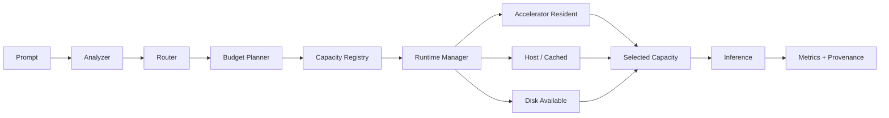
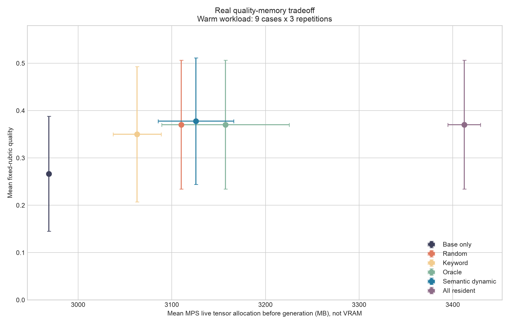

# SelectiveLLM

### Adaptive Compute and Capacity Routing for Language Models

[](https://github.com/AltanCetinCelik/SelectiveLLM/actions/workflows/ci.yml)
[](https://www.python.org/)
[](LICENSE)
[](docs/paper.md)

**SelectiveLLM explores a simple question: why activate or keep all available model capacity when a request may need only a small part of it?**

Instead of treating an LLM as one fixed block of compute, SelectiveLLM treats model capacity as a runtime resource that can be **selected, loaded, cached, rejected, or expanded depending on the request and the available budget**.

Today the framework supports real PEFT/LoRA capacity routing and runtime residency management. The broader research direction is **task-conditioned adaptive computation** across adapters, experts, models, and eventually hardware-efficient parameter blocks.

```text
                         Prompt
                           │
                           ▼
                  ┌─────────────────┐
                  │  SelectiveLLM   │
                  │    Controller   │
                  └────────┬────────┘
                           │
               What capacity is useful?
                           │
             ┌─────────────┼─────────────┐
             ▼             ▼             ▼
          Adapter        Expert        Model
             │             │             │
             └─────────────┼─────────────┘
                           ▼
                  Budget-aware planner
                           │
              memory / latency / locality
                           │
                           ▼
                 Selected computation
                           │
                           ▼
                       Inference
```

> **Long-term goal:** execute the **minimum sufficient computation** required for each request while preserving output quality.

---

## Why SelectiveLLM?

Most inference systems start with a fixed assumption:

> Load the model and run the available capacity.

SelectiveLLM investigates a different assumption:

> Determine what capacity the request needs first, then spend memory and compute selectively.

That creates a general optimization problem:

```text
request
   ↓
capacity candidates
   ↓
expected usefulness
   +
memory cost
   +
load latency
   +
cache locality
   ↓
runtime capacity plan
```

The current implementation focuses on adapters and independently loadable experts because they provide a measurable testbed for this idea.

The architecture is deliberately broader than LoRA routing.

| Capacity type | Current status |
|---|---|
| PEFT / LoRA adapters | ✅ Implemented and measured |
| Runtime expert loading | ✅ Implemented |
| Memory-budget planning | ✅ Implemented |
| Dependency-aware cache / eviction | ✅ Implemented |
| Multiple routing policies | ✅ Implemented |
| Real accelerator memory telemetry | ✅ MPS / CUDA where available |
| Learned capacity router | 🔬 Planned |
| Calibrated uncertainty / abstention | 🔬 Planned |
| Multi-model capacity routing | 🔬 Planned |
| Utility-aware compute optimization | 🔬 Planned |
| Dense parameter-block selection | 🧪 Research |
| Physical semantic parameter paging | ❌ Not yet demonstrated |

---

## 30-second demo

Clone the repository and run the offline demo:

```bash
git clone https://github.com/AltanCetinCelik/SelectiveLLM.git
cd SelectiveLLM

python3.11 -m venv .venv
source .venv/bin/activate

pip install -e .
selectivellm demo
```

The demo:

- analyzes each request,
- identifies candidate capabilities,
- routes the request,
- creates a memory-constrained capacity plan,
- loads or reuses the selected components,
- reports cache activity,
- reports stage-level latency,
- and records memory semantics explicitly.

Example workflow:

```text
Prompt:
"Use Python to simulate an RLC circuit."

Detected capabilities:
  python                  0.83
  electrical_engineering  0.78
  mathematics             0.45

Candidate capacity:
  python_expert
  electronics_expert
  math_expert

Budget:
  850 MB

Selected:
  base
  python_expert
  electronics_expert

Rejected:
  math_expert -> memory_budget

Inference:
  base + selected capacity
```

The default demo uses the deterministic control backend so it runs without downloading model weights.

---

## Architecture


```mermaid
flowchart LR
    P[Prompt] --> A[Analyzer]
    A --> R[Router]
    R --> B[Budget Planner]
    B --> C[Capacity Registry]
    C --> M[Runtime Manager]

    M --> G[Accelerator Resident]
    M --> H[Host / Cached]
    M --> D[Disk Available]

    G --> I[Selected Capacity]
    H --> I
    D --> I

    I --> N[Inference]
    N --> X[Metrics + Provenance]
```

SelectiveLLM separates the system into independent stages:

```text
Prompt
  ↓
Analyzer
  ↓
Router
  ↓
Capacity candidates
  ↓
Budget-aware planner
  ↓
Runtime loader / cache
  ↓
Inference backend
  ↓
Metrics + reproducibility metadata
```

This separation makes it possible to test routing policies without silently changing memory policy, backend behavior, or benchmark methodology.

---

## What works today

SelectiveLLM currently includes:

- multi-label prompt analysis,
- static routing,
- keyword routing,
- random routing,
- oracle routing,
- local embedding routing,
- threshold and top-k routing,
- hybrid routing,
- versioned capacity registries,
- dependency-aware planning,
- configurable memory budgets,
- LRU-style expert lifecycle management,
- load / unload / transfer telemetry,
- cache hit and miss tracking,
- Transformers + PEFT inference,
- deterministic offline controls,
- CUDA → MPS → CPU device detection,
- stage-separated latency metrics,
- accelerator / host memory semantics,
- benchmark manifests and fingerprints,
- reproducible raw results,
- negative-result preservation,
- dense causal-capacity research tooling.

The CLI and Python API use the same underlying engine.

---

## Real-model evidence

A pinned experiment was run using:

```text
Base model: Qwen2.5-1.5B-Instruct
Backend:    Transformers + PEFT
Experts:    code / math / science LoRA adapters
Hardware:   Apple M4, 16 GB unified memory, MPS
```

The semantic routing policy reached:

```text
Routing F1
──────────────
Random       0.278
Keyword      0.611
Semantic     0.830
Oracle       1.000
```

Dynamic semantic routing used:

```text
3125.7 MB MPS live allocation
```

versus:

```text
3412.2 MB all-resident
```

for a measured difference of approximately:

```text
286 MB
```

in live MPS tensor allocation.

The experiment therefore demonstrated that **runtime capacity selection changes real model residency**.

It did **not** demonstrate a reliable answer-quality advantage from the existing routing policy.

That distinction is important.

Full evidence:

- [Real-model analysis](docs/real_model_evidence.md)
- [Run report](results/real/latest/report.md)
- [Raw responses](results/real/latest/raw_responses.jsonl)
- [Manifest](results/real/latest/manifest.json)



---

## Research status

SelectiveLLM intentionally separates demonstrated system behavior from open hypotheses.

### Demonstrated

✅ Real adapter loading and unloading

✅ Runtime capacity residency changes

✅ Memory-budget-aware planning

✅ Dependency-aware cache behavior

✅ Measurable load and swap latency

✅ Semantic routing can outperform keyword/random routing on the current routing labels

✅ Reproducible deterministic and real-model experiment pipelines

### Not yet demonstrated

⚠️ Reliable output-quality improvement from semantic adapter routing

⚠️ Robust domain specialization across the current expert pool

⚠️ Generalization to large public held-out workloads

⚠️ Learned calibrated capacity routing

❌ Stable semantic decomposition of dense model parameters

❌ Physical parameter paging based on prompt semantics

The dense Qwen2.5-1.5B and 3B causal-localization experiments both failed their preregistered stable-specialization gates.

Those negative results are preserved rather than removed.

See:

- [Dense 1.5B causal report](results/real/causal_importance/latest/report.md)
- [Dense 3B replication](results/real/causal_scale_qwen3b/latest/report.md)
- [Hostile review](docs/hostile_review.md)

---

## The broader research direction

The current adapter experiments are a proxy for a more general problem.

SelectiveLLM ultimately targets:

```text
state / request
      ↓
adaptive compute controller
      ↓
┌─────────────────────────────┐
│ Which model?                │
│ Which expert?               │
│ Which adapter?              │
│ How much capacity?          │
│ What should stay resident?  │
│ What should be loaded?      │
│ When should we fall back?   │
└─────────────────────────────┘
      ↓
minimum sufficient computation
```

The desired optimization target is not routing accuracy by itself.

A future controller should optimize something closer to:

```text
expected utility
    =
expected quality gain
    - memory cost
    - loading cost
    - latency cost
    - uncertainty penalty
```

subject to runtime constraints such as:

```text
memory <= budget
latency <= target
quality >= acceptable threshold
```

This is the direction planned for the next generation of the framework.

---

## Current routing limitation

The current default analyzer is intentionally transparent and deterministic.

It uses:

- lexical evidence,
- feature hashing,
- local similarity features.

It is **not yet a trained semantic encoder**.

This keeps the v0.1 benchmark reproducible and offline, but it is not intended to be the final routing architecture.

A planned learned routing stack will evaluate:

```text
keyword
vs
feature-hash
vs
embedding encoder
vs
learned classifier
vs
oracle
```

with probability calibration and abstention.

---

## Quickstart

Python 3.11 or newer is required.

```bash
git clone https://github.com/AltanCetinCelik/SelectiveLLM.git
cd SelectiveLLM

python3.11 -m venv .venv
source .venv/bin/activate

pip install -e .
selectivellm demo
```

Run a prompt:

```bash
selectivellm run \
  --prompt "Explain a MOSFET gate driver" \
  --verbose
```

Run the reproducible benchmark:

```bash
selectivellm benchmark \
  --report \
  --repetitions 5 \
  --seed 42
```

---

## Python API

```python
from selectivellm import SelectiveLLM

engine = SelectiveLLM.from_config("configs/default.yaml")

result = engine.generate(
    "Use Python to simulate an RLC circuit and plot the transient response"
)

print(result.text)

print("Capabilities:")
print(result.profile.capabilities)

print("Selected capacity:")
print(result.routing.selected)

print("Rejected capacity:")
print(result.plan.rejected)

print("Memory:")
print(result.memory)

print("Metrics:")
print(result.metrics)
```

---

## Real Transformers + PEFT

Install the optional Hugging Face backend:

```bash
pip install -e ".[hf]"
```

Then configure compatible local or Hugging Face model and adapter paths.

Example:

```bash
selectivellm run \
  --config configs/transformers_peft.example.yaml \
  --prompt "Explain a MOSFET gate driver"
```

The real backend supports:

- causal language models,
- named PEFT adapters,
- adapter activation,
- adapter eviction where supported,
- accelerator timing synchronization,
- real memory telemetry where PyTorch exposes it.

`trust_remote_code` defaults to `false`.

Model and adapter licenses remain separate from the SelectiveLLM Apache-2.0 license.

---

## CLI

```bash
# Demo
selectivellm demo

# Route and generate
selectivellm run \
  --prompt "Explain a MOSFET gate driver" \
  --verbose

# Benchmark one router
selectivellm benchmark \
  --router semantic \
  --report

# Benchmark the method matrix
selectivellm benchmark \
  --report \
  --repetitions 5

# Inspect runtime
selectivellm inspect

# Profile one request
selectivellm profile \
  --prompt "Write a Python FastAPI endpoint"

# Inspect available capacity
selectivellm registry list

selectivellm registry inspect python_expert
```

---

## Benchmark philosophy

SelectiveLLM treats routing, memory, latency, and quality as separate measurements.

The main latency decomposition is:

```text
T_total =
    T_route
  + T_plan
  + T_load
  + T_inference
  + T_orchestration
```

Generated experiment directories include:

```text
results/<run-id>/
├── config.yaml
├── environment.json
├── manifest.json
├── raw_results.jsonl
├── routing_decisions.jsonl
├── summary.json
├── summary.csv
├── report.md
├── routing_failures.md
└── plots/
```

Read [docs/benchmarking.md](docs/benchmarking.md) for the full methodology.

---

## Research tracks

SelectiveLLM is now best understood as two related research tracks.

### Track A — Adaptive Runtime

Near-term engineering and evaluation:

- learned capacity routing,
- calibrated probabilities,
- uncertainty-aware fallback,
- cost-aware planning,
- larger expert pools,
- model routing,
- cache and prefetch policies,
- quality-memory-latency Pareto optimization.

### Track B — Selective Dense Compute

Higher-risk research:

- causal capacity localization,
- stable parameter masks,
- hardware-aligned block selection,
- contextual sparsity,
- sparse execution,
- eventual parameter paging.

Track A does not depend on Track B succeeding.

---

## Roadmap

### v0.2 — Adaptive Compute Router

Planned priorities:

1. learned semantic capacity router,
2. calibrated routing probabilities,
3. abstention / full-model fallback,
4. quality-cost-aware planning,
5. larger held-out evaluation set,
6. counterbalanced workloads,
7. public benchmark tasks where possible,
8. quality-memory-latency Pareto reporting,
9. expanded model / expert capacity types,
10. simplified installation and interactive demo.

Dense semantic parameter paging remains a separate experimental track and will not be claimed until physical savings and retained quality are demonstrated.

See [docs/roadmap.md](docs/roadmap.md).

---

## Related work

SelectiveLLM overlaps with several research areas:

- Mixture-of-Experts,
- model routing,
- adapter routing,
- conditional computation,
- contextual sparsity,
- heterogeneous memory,
- model offloading,
- parameter-efficient fine-tuning,
- knowledge localization.

The project does **not** claim that these individual ideas are new.

The intended contribution is the framing and runtime system for treating independently selectable model capacity as a **budgeted resource** and evaluating routing, residency, transfer cost, quality, and falsification together.

See [docs/related_work.md](docs/related_work.md).

---

## Documentation

### Core

- [Concepts](docs/concepts.md)
- [Architecture](docs/architecture.md)
- [Benchmark methodology](docs/benchmarking.md)
- [Related work](docs/related_work.md)
- [Research questions](docs/research_questions.md)
- [Roadmap](docs/roadmap.md)

### Experimental evidence

- [Technical report](docs/paper.md)
- [Real-model evidence](docs/real_model_evidence.md)
- [Expert-pool diagnostic](results/real/expert_quality/latest/report.md)
- [Dense 1.5B causal report](results/real/causal_importance/latest/report.md)
- [Dense 3B replication](results/real/causal_scale_qwen3b/latest/report.md)
- [Hostile review](docs/hostile_review.md)

---

## Development

```bash
pip install -e ".[dev]"

ruff format --check .
ruff check .
mypy selectivellm

pytest \
  --cov=selectivellm \
  --cov-report=term-missing \
  --cov-fail-under=70

python -m build
```

The default test suite is network-free and does not download model weights.

Optional real-model integration tests require user-supplied compatible assets.

---

## What SelectiveLLM is not

SelectiveLLM is not:

- a document RAG framework,
- a claim that dense models already contain clean page-ready semantic blocks,
- a newly trained Mixture-of-Experts architecture,
- a claim that a 70B dense model can currently run with 7B-equivalent memory,
- a replacement for quantization,
- a replacement for conventional offloading.

These techniques can be complementary.

SelectiveLLM focuses specifically on **request-conditioned capacity selection and runtime resource planning**.

---

## Citation

Use [CITATION.cff](CITATION.cff) when citing the project.

When citing experimental results, include the relevant benchmark fingerprint and manifest.

The SelectiveLLM software is licensed under Apache-2.0.

External models and adapters retain their original licenses.

---

## Contributing

Reproducible positive, null, contradictory, and negative results are welcome.

Before contributing, see:

- [CONTRIBUTING.md](CONTRIBUTING.md)
- [SECURITY.md](SECURITY.md)
- [CODE_OF_CONDUCT.md](CODE_OF_CONDUCT.md)
