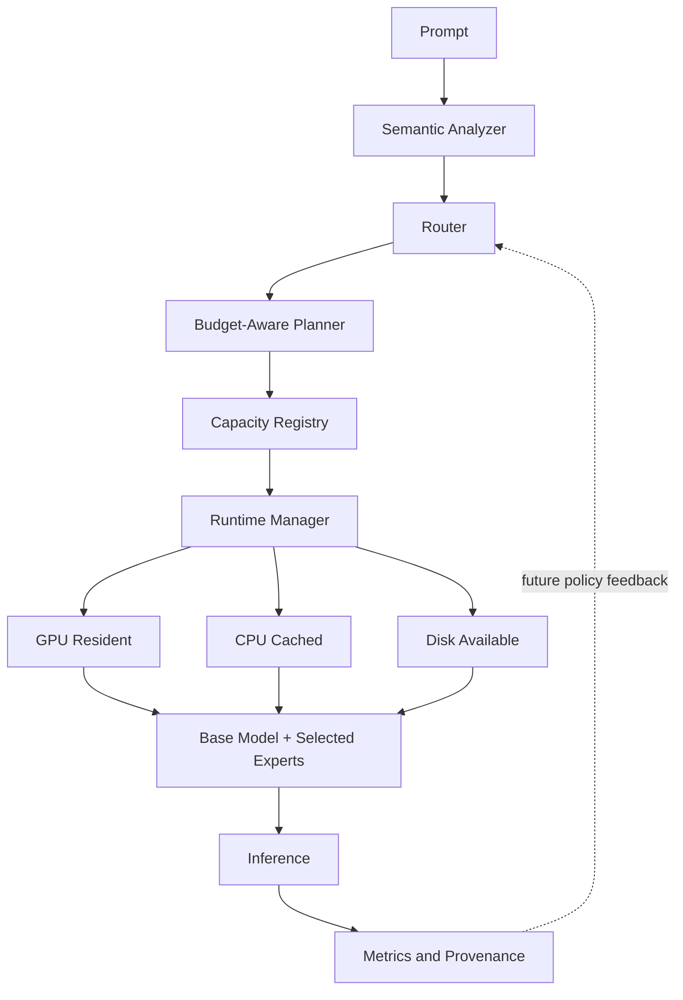

# Architecture

## System view

The diagram includes future placement states. v0.1 implements registry-defined component lifecycle and a declared-capacity LRU. The Transformers/PEFT backend loads real components, while arbitrary disk/CPU/GPU migration is limited by what that backend and platform expose.

## Component contracts

### Analyzer

Input: prompt text. Output: a multi-label `PromptProfile` with domain/task scores, capabilities, confidence, and lexical evidence. The default analyzer uses deterministic local feature hashing and transparent domain signals. It is intentionally lightweight and replaceable.

### Router

Input: profile and registry. Output: ranked candidates, selected component IDs, scores, confidence, latency, and debug metadata. Oracle labels are accepted only by the oracle benchmark router. Production routers never receive benchmark ground truth.

### Planner

Input: routing decision, registry dependencies, and memory budget. Output: an executable component list plus rejected components and reasons. Routing expresses desired capabilities; planning records what the budget permits.

### Registry

The versioned YAML registry is the source of truth for component identity, type, domain, declared capacity, backend, paths, tasks, embeddings, priority, dependencies, and optional parameter counts. Declared capacity is metadata. It is never silently relabeled as observed VRAM.

### Runtime

The runtime resolves dependencies, loads missing components, records hits and misses, evicts least-recently-used unprotected components, synchronizes backend work around timing boundaries, and captures memory snapshots. The base component is pinned while experts are cacheable.

### Backend

Both control and real implementations expose `load_component`, `unload_component`, `generate`, and `synchronize`. This keeps benchmark methodology invariant when replacing the control backend with Transformers/PEFT.

The real backend defaults to `trust_remote_code=False`, selects CUDA then MPS then CPU, supports Accelerate device maps on CUDA, and loads named PEFT adapters. Adapter composition depends on model and PEFT compatibility; unsupported combinations fail explicitly.

### Metrics and recorder

The engine records routing, planning, loading, inference, orchestration, first-token, throughput, cache, swap, parameter, declared-capacity, process RAM, and available accelerator measurements. The benchmark layer adds quality, routing metrics, aggregate statistics, fingerprints, environment metadata, raw observations, plots, and failure analysis.

## Data flow and state

`SelectiveLLM.generate` is stateless with respect to prompt analysis and routing but stateful with respect to the runtime cache. Benchmarks create one engine per method so cache state cannot leak across baselines. The cache-enabled method keeps experts across prompts; the uncached method releases experts after each request. Every method begins with a fresh runtime.

## Extension boundaries

New analyzers, routers, and backends implement small interfaces. New component types can enter the registry schema before runtime support, but documentation must identify them as unsupported until a backend implements their lifecycle. Future parameter shards must not reuse the adapter implementation while claiming finer granularity.

