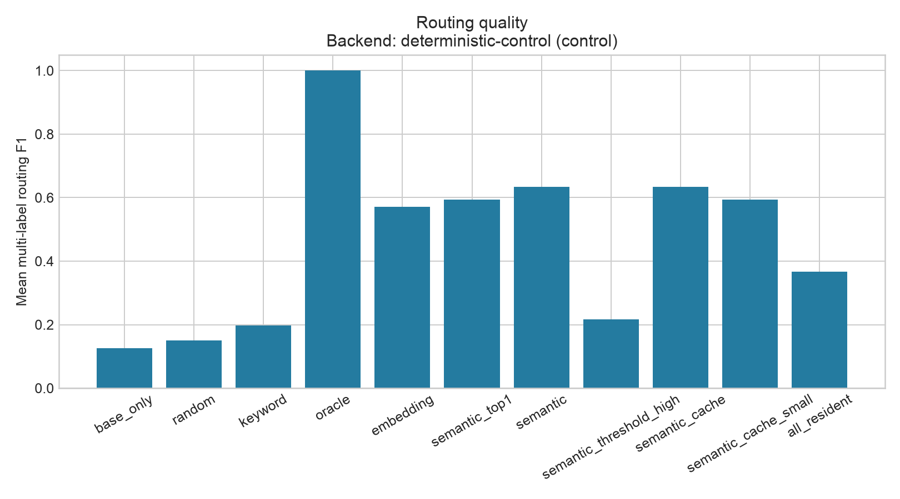
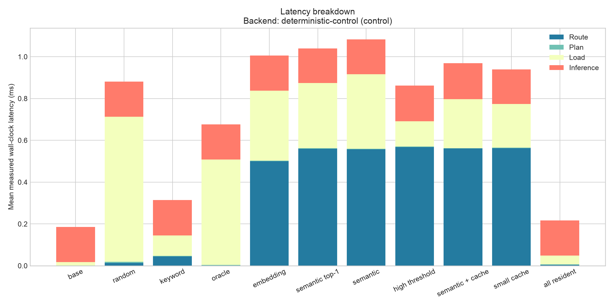
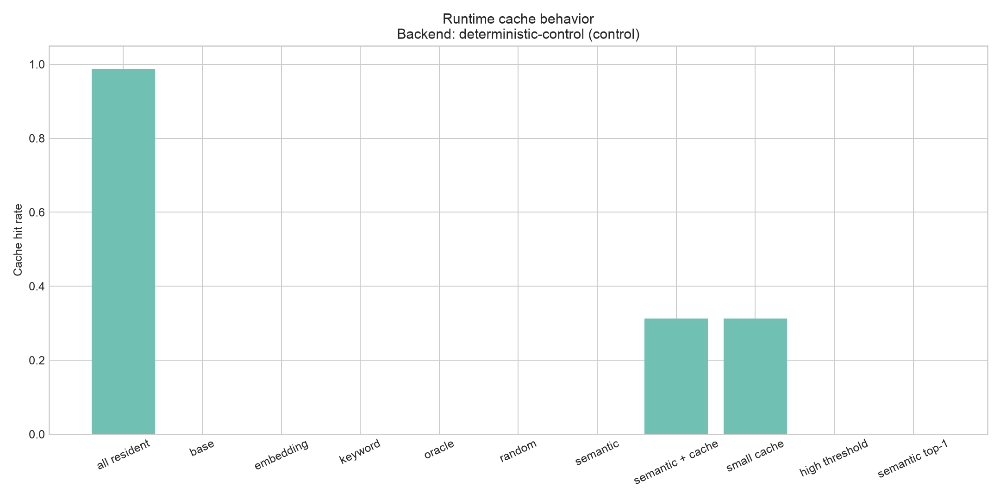
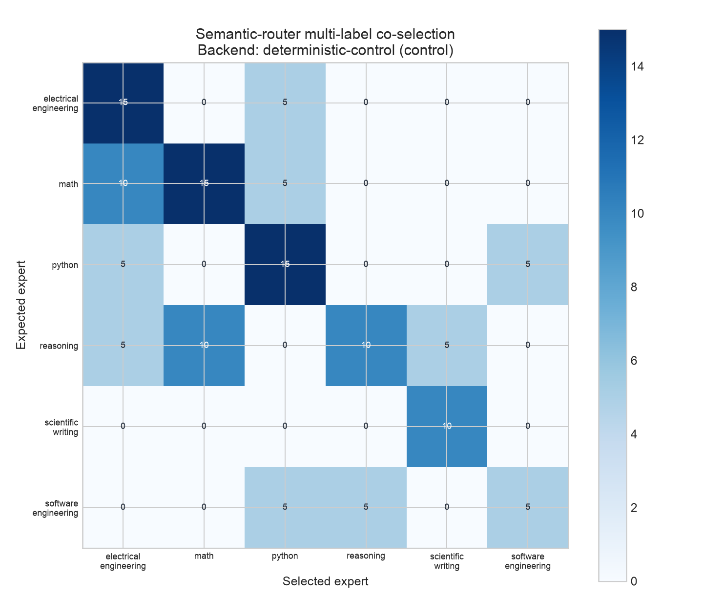

# SelectiveLLM Benchmark Report

**Backend:** `deterministic-control` (`control`)
**Model identity:** `selectivellm-control-v1`
**Benchmark:** `hero-1.0.0`
**Fingerprint:** `3792ea55c906065d90f9a79b15b301169e929817fad7fde76491f9c751a6a34d`
**Device class:** `cpu`

> Deterministic-control results validate routing and benchmark methodology. They do not demonstrate physical VRAM savings or language-model quality.

## Hardware and software

```json
{
  "accelerator": null,
  "accelerator_memory_mb": null,
  "architecture": "arm64",
  "cpu": "arm",
  "cuda_version": null,
  "device": "cpu",
  "device_class": "cpu",
  "git_commit": "2604737b3b2e3898b55978c02fb671f90b40b16f",
  "logical_cpus": 10,
  "mps_available": false,
  "os": "Darwin",
  "os_version": "25.5.0",
  "packages": {
    "matplotlib": "3.11.1",
    "numpy": "2.2.6",
    "peft": null,
    "psutil": "7.2.2",
    "pydantic": "2.13.5",
    "selectivellm": "0.1.0",
    "torch": null,
    "transformers": null
  },
  "platform": "macOS-26.5.2-arm64-arm-64bit",
  "python_version": "3.12.14",
  "source_dirty": true,
  "torch_version": null,
  "total_ram_gb": 16.0
}
```

## Methods and results

| Method | n | Quality | Quality retention | Routing F1 | Declared peak MB | Declared reduction | Latency p50 ms | Latency p95 ms | Cache hit rate |
|---|---:|---:|---:|---:|---:|---:|---:|---:|---:|
| base_only | 80 | 0.431 | 43.1% | 0.125 | 500.0 | 68.4% | 0.392 | 0.447 | 0.000 |
| random | 80 | 0.514 | 51.4% | 0.150 | 860.0 | 45.6% | 1.090 | 1.229 | 0.000 |
| keyword | 80 | 0.503 | 50.3% | 0.198 | 680.0 | 57.0% | 0.444 | 0.786 | 0.000 |
| oracle | 80 | 1.000 | 100.0% | 1.000 | 1019.8 | 35.5% | 1.041 | 1.386 | 0.000 |
| embedding | 80 | 0.760 | 76.0% | 0.633 | 857.8 | 45.7% | 1.229 | 1.562 | 0.000 |
| semantic_top1 | 80 | 0.767 | 76.7% | 0.656 | 680.0 | 57.0% | 1.280 | 1.398 | 0.000 |
| semantic | 80 | 0.801 | 80.1% | 0.696 | 857.8 | 45.7% | 1.296 | 1.625 | 0.000 |
| semantic_threshold_high | 80 | 0.516 | 51.6% | 0.217 | 842.0 | 46.7% | 0.970 | 1.637 | 0.000 |
| semantic_cache | 80 | 0.801 | 80.1% | 0.696 | 857.8 | 45.7% | 1.281 | 1.380 | 0.312 |
| semantic_cache_small | 80 | 0.767 | 76.7% | 0.656 | 680.0 | 57.0% | 1.260 | 1.379 | 0.312 |
| all_resident | 80 | 0.963 | 96.2% | 0.368 | 1580.0 | 0.0% | 0.401 | 0.431 | 0.988 |

Statistics include count, mean, median, standard deviation, p50, p95, and a normal-approximation 95% confidence interval where more than one observation exists. Case-level observations are not independent repeated training runs; intervals characterize this workload only.

## Plots










## Interpretation

Semantic routing changed the backend-specific quality score by +0.369 relative to base-only. Its mean routing F1 differed from keyword routing by +0.498. Caching changed mean control-backend load time by -0.122 ms (cached minus uncached). These observations support conclusions only for the labeled backend, workload, configuration, and measurement semantics.

## Limitations

- Declared capacity is registry metadata. For the deterministic-control backend it is simulated and is not observed VRAM.
- Control task quality is synthetic capability coverage, not natural-language answer quality.
- Routing performance on this small authored workload may not generalize.
- Wall-clock timings describe this backend and machine; they are not model-loading forecasts.
- A real Transformers/PEFT run is required for physical accelerator-memory and model-quality conclusions.

## Negative-result policy

Null and negative outcomes are retained. The benchmark is not tuned after inspection solely to favor semantic routing.
