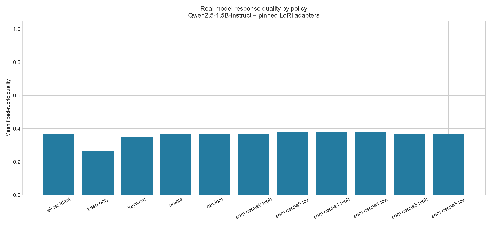
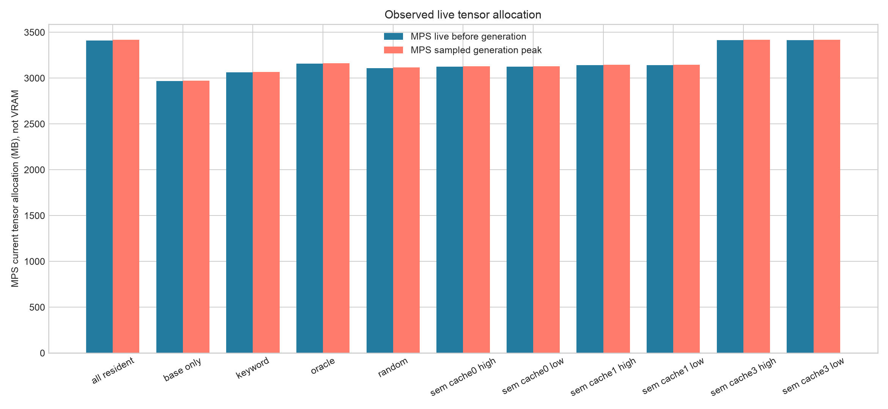
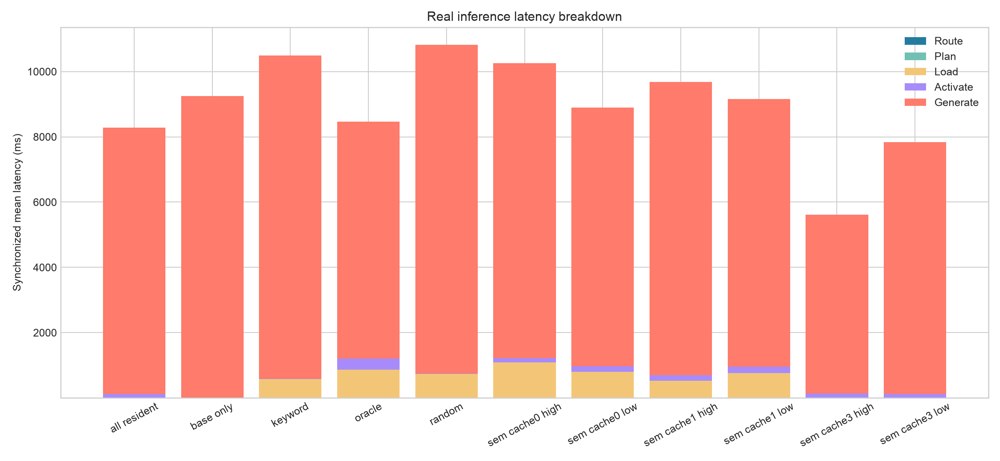
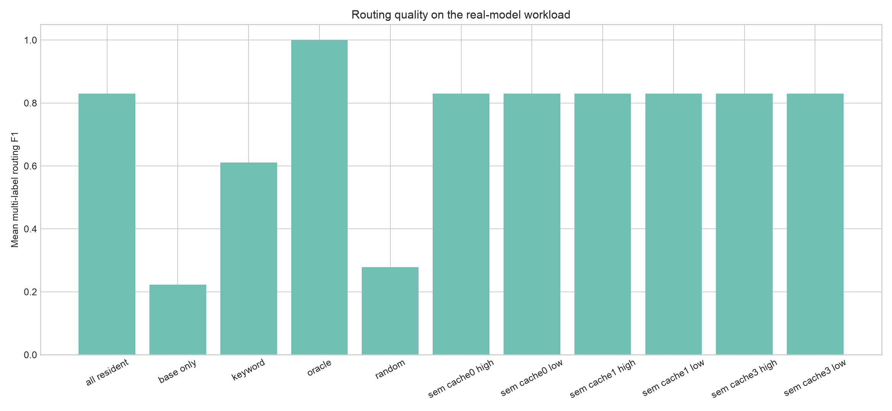
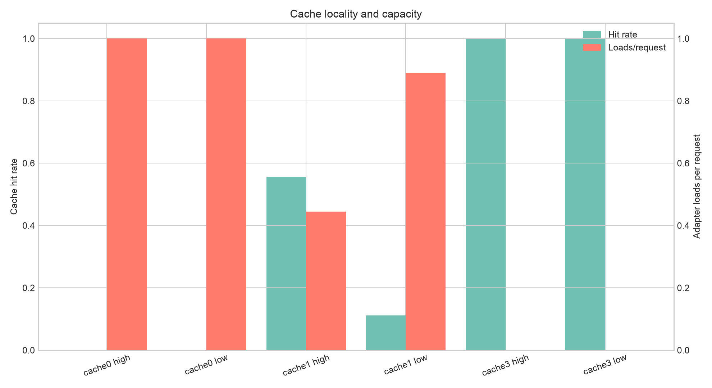

# SelectiveLLM v0.1.1 Real-Model Report

**Backend:** `transformers-peft` (`real`)
**Base:** `Qwen/Qwen2.5-1.5B-Instruct` at `989aa7980e4cf806f80c7fef2b1adb7bc71aa306`
**Device:** `Apple Metal Performance Shaders` / `mps`
**Benchmark:** `real-hero-1.0.0`
**Fingerprint:** `a24ac14e5122d5681ddf091602c57777897c6a637d578ce6407dc8031fe51b03`

> MPS current allocation, MPS driver allocation, and host RSS are separate unified-memory signals. None is labeled discrete VRAM.

## Warm repeated workload

| Policy | n | Quality | vs base | vs oracle | Routing F1 | MPS live MB | Driver MB | Load ms | First token ms | End-to-end ms | Hit rate |
|---|---:|---:|---:|---:|---:|---:|---:|---:|---:|---:|---:|
| all_resident | 27 | 0.370 | 0.104 | 0.000 | 0.830 | 3412.159 | 3602.750 | 0.000 | 410.047 | 8296.277 | 1.000 |
| base_only | 27 | 0.267 | 0.000 | -0.104 | 0.222 | 2968.777 | 3170.750 | 0.000 | 358.811 | 9261.644 | N/A |
| keyword | 27 | 0.350 | 0.083 | -0.020 | 0.611 | 3063.006 | 3282.750 | 582.213 | 292.995 | 10573.937 | 0.000 |
| oracle | 27 | 0.370 | 0.104 | 0.000 | 1.000 | 3157.253 | 3614.251 | 861.736 | 236.431 | 8594.039 | 0.000 |
| random | 27 | 0.370 | 0.104 | 0.000 | 0.278 | 3110.121 | 3280.380 | 734.933 | 259.968 | 10937.697 | 0.000 |
| semantic_cache0_high | 27 | 0.370 | 0.104 | 0.000 | 0.830 | 3125.732 | 3462.306 | 1086.235 | 327.981 | 10384.556 | 0.000 |
| semantic_cache0_low | 27 | 0.378 | 0.111 | 0.007 | 0.830 | 3125.732 | 3464.380 | 796.888 | 249.590 | 9019.740 | 0.000 |
| semantic_cache1_high | 27 | 0.378 | 0.111 | 0.007 | 0.830 | 3141.384 | 3463.961 | 521.498 | 473.384 | 9751.902 | 0.556 |
| semantic_cache1_low | 27 | 0.378 | 0.111 | 0.007 | 0.830 | 3141.384 | 3458.750 | 755.753 | 277.486 | 9274.428 | 0.111 |
| semantic_cache3_high | 27 | 0.370 | 0.104 | 0.000 | 0.830 | 3413.138 | 3602.750 | 0.000 | 272.191 | 5612.470 | 1.000 |
| semantic_cache3_low | 27 | 0.370 | 0.104 | 0.000 | 0.830 | 3413.141 | 3602.750 | 0.000 | 370.863 | 7846.743 | 1.000 |

Cold-workload observations and full variability statistics are retained in `summary.json` and `summary.csv`; the table above does not pool them with warm repetitions.

## Observed conclusion

Semantic routing reached 0.830 routing F1 versus 0.611 keyword and 0.278 random. Its quality was 0.378, but random and oracle both scored 0.370. Better routing therefore did not establish a reliable aggregate quality advantage.

Dynamic semantic routing used 3125.732 MB mean MPS live tensor allocation versus 3412.159 MB all-resident, a measured reduction of 286.427 MB on Apple unified memory.

Cache size 1 reached 55.6% request hits at high locality and 11.1% at low locality. Cache size 3 reached 100% by retaining all source adapters. End-to-end policy timings are not a counterbalanced causal estimate because policies ran sequentially.

The RLC matrix in `rlc_matrix.jsonl` preserves the completed but degraded weighted-linear composition result. See the [full evidence interpretation](../../../docs/real_model_evidence.md) and `failure_analysis.md`.

## Plots

## Measurement boundaries

- Quality is a fixed deterministic rubric, not synthetic routing coverage and not an LLM judge.
- Cache hit rate is weighted over adapter requests; prompts requesting no adapter are excluded.
- All-resident means all adapter tensors were loaded; active adapters are recorded separately.
- MPS live tensor allocation excludes allocator caches. Metal driver allocation includes caches and framework allocations.
- Host RSS overlaps conceptually with accelerator use on Apple unified memory and must not be added to MPS figures.
- Generation peaks are sampled because MPS exposes no CUDA-equivalent peak allocator counter.
- Negative and adapter-degraded results are retained.
